## NLOS Radar Perception for ADAS

> **"Giving autonomous vehicles a 'cheat code' to see around blind corners."**

## Overview

**NLOS (Non-Line-of-Sight) Radar Perception** is an embedded systems research project designed to solve one of the most dangerous scenarios in autonomous driving: **The Blind Corner.**

Standard ADAS (Advanced Driver Assistance Systems) relies on direct Line-of-Sight. If a camera or LiDAR cannot see a hazard directly, it assumes the road is clear. This project aims to exploit **Multipath Propagation**usually considered "noise" in radar engineering to mathematically reconstruct objects hidden behind obstacles.

By treating walls as "mirrors" for mmWave radar signals, this system intends to detect, localize, and track vehicles before they are even visible to the human eye.

## The Concept: "Seeing" Around Corners

Conventional radar filters out reflections to avoid "ghost targets." This project does the opposite,it captures them to create a virtual view of hidden areas.

### The Physics
1.  **Multipath Detection:** The radar signal hits a wall, bounces to a hidden car, bounces back to the wall, and returns to the sensor.
2.  **Ghost Formation:** To the radar, the target appears to be *inside* or *behind* the wall.
3.  **The "Mirror" Transformation:**
    * The system will use **RANSAC** (Random Sample Consensus) to identify static walls.
    * It will then apply geometric reflection matrices to "unfold" the ghost coordinates, mapping them to their true location in the real world.

---

## Project Goals

The goal is to build a functional prototype using **ROS 2** and **Python** that can:
1.  Ingest point cloud data from a **TI mmWave Radar**.
2.  Distinguish between static walls and dynamic hidden objects.
3.  Visualize the "Hidden" traffic on a map in real-time.

## 🔮 Roadmap

* **Phase 1:** Research & Environment Setup (ROS 2 Humble).
* **Phase 2:** Development of the Wall Detection Algorithm (RANSAC).
* **Phase 3:** Implementation of Reflection Geometry Math.
* **Phase 4:** Real-world testing with corner scenarios.

---

## License

This project is licensed under the **MIT License** - see the `LICENSE` file for details.

> **Note:** This repository is currently in the initial research and development phase.

** Project Structure :

```mermaid
graph TD
    %% Hardware Layer
    subgraph Hardware ["Hardware / Simulation"]
        Radar[("📡 TI AWR1642 Radar<br>(or Sim Node)")]
    end

    %% ROS 2 Middleware Layer
    subgraph ROS2 ["ROS 2 System (The Brain)"]
        direction TB
        
        %% Driver
        Driver["📦 Radar Driver<br>(Publishes PointCloud2)"]
        
        %% The Core Algorithm
        subgraph WallHack ["🔮 Project WallHack Core"]
            Filter["1️⃣ Velocity Filter<br>(Separates Static vs Dynamic)"]
            
            WallFit["2️⃣ RANSAC Wall Detector<br>(Finds 'Mirror' Line)"]
            
            Solver["3️⃣ Geometry Solver<br>(Reflects 'Ghost' to Real Pos)"]
        end
    end

    %% Visualization Layer
    subgraph UI ["User Interface"]
        Rviz[("🖥️ Rviz2 Visualization<br>(Map & Alerts)")]
    end

    %% Connections
    Radar -->|USB / Serial| Driver
    Driver -->|"/radar/raw_points"| Filter
    
    Filter -->|"Static Points (v=0)"| WallFit
    Filter -->|"Dynamic Points (v>0)"| Solver
    
    WallFit -.->|"Line Eq: ax+by+c=0"| Solver
    
    Solver -->|"/wallhack/hidden_threats"| Rviz
    WallFit -->|"/wallhack/wall_marker"| Rviz

    %% Styling
    classDef hardware fill:#e1f5fe,stroke:#01579b,stroke-width:2px;
    classDef ros fill:#e8f5e9,stroke:#2e7d32,stroke-width:2px;
    classDef ui fill:#fff3e0,stroke:#ef6c00,stroke-width:2px;
    
    class Radar hardware;
    class Driver,Filter,WallFit,Solver ros;
    class Rviz ui;
```

